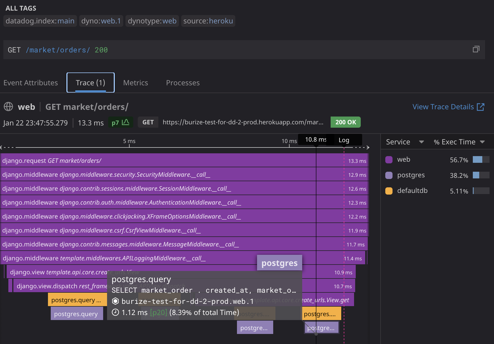

# Django-starterkit

Starterkit for Python+Django project. There are several Django's apps as examples.


## Routing
Starterkit provides its own api for routing over models from Django Rest Framework. The routing mechanism of DRF relies on DjangoORM too much, though it provides some base classes with low coupling with DjangoORM, such classes don't provide usefull api for routing, request's argument deserialization, excepton handling and etc.   

Use api decorators for binding a controller method for a route:
- `@api.router_\[http_method\]('path/{path_param}/{?query_params=default_value}')`

For example:

```
@api.controller('orders/') <--- base path for controller
class OrderController():
    @api.router_get('path/{order_id}/{?is_paid=False}')
    def get_order(self, order_id: str, is_paid: bool ):
```
- `@api.without_authentication`- can be specified for controller class to disable authentication. For default `SessionAuthentication` for all methods.

- `@api.permissions('permission')`  - requires permission for an authenticated user, based on the Permission model from Django: e.x. `@api.permissions('market.view_product')`.

- `@api.raises(Exception, HTTPStatus)` - for binding exception for HTTP status code otherwise, an exception is handled by the base exception handler.

For example
```
    @api.router_post('login/')
    @api.raises(CustomException, HTTPStatus.BAD_REQUEST)
    def login(self):
        raise CustomException('error')
```

- You can get request payload by specification argument with name `request_body` in controller method and it automatically parsed to specified type: int, Dict, dataclass and etc. 
To obtain Django's request, just specify any argument with type `Request` :

```
@dataclass
class LoginDTO:
    username: str
    password: str
    
@dataclass
class AccountDTO:
    id: UUID
    email: str

@api.controller('')
@api.without_authentication
class AuthController:
    @inject
    def __init__(self, auth_service: AuthService):
        self._auth_service = auth_service

    @api.router_post('login/')
    @api.raises(AuthenticationException, HTTPStatus.UNAUTHORIZED)
    def login(self, request: Request, request_body: LoginDTO):
        account = self._auth_service.authenticate(username=request_body.username, password=request_body.password)
        
        login(request, account.user)

        return AccountDTO(id=account.id, email=account.email)
````

If controller method returns dataclass (or some base type: int, bool, float and etc) it's serialized and pass as payload to Django response.


## Model

Because it's starterkit it uses DjangoORM as ORM:
- probably it should be known for all Django user
- admin panel, permission, authentication provided by Django are useful on project start.

But, if you have opportunity to change ORM, it's highly recommended to use [SQLAlchemy](https://www.sqlalchemy.org/) as ORM instead of DjangoORM. SQLAlchemy is more flexible, open to changes, has a great community.
Also, it doesn't have such problems as Django does: 
- absence of database level operations/constructions: cascade delete, join, default value and etc <- all these are handled only on python/django side.
- absence of [identity map](https://www.martinfowler.com/eaaCatalog/identityMap.html)

## Testing
[Pytest](https://docs.pytest.org/) is used for writing and running tests.

## Start project 

You can start project via docker. Run `docker compose up` to build and run the postgres-db and the web-server containers. After that, you only need to run the command to apply migrations in the web-server container: `python manage.py migrate` - see for examples [Run a command in a running container](https://docs.docker.com/engine/reference/commandline/exec/)

You can also start project without docker by these steps:

1. Install dependencies (pipenv creates virtualenv automatically): 
```
pipenv install
```

2. Copy `.env.example` file to `.env`
    
    2.1 Specify appropriate `DATABASE_URL` to access your database

3. Enter to shell - it runs your commands with parameters specified in `.env`
```
pipenv shell
```

4. Run database migrations:
```
python manage.py migrate
```

After this steps (or building project via docker) you can apply some if these commands:
- fill database with initial data: `python manage.py runscript create_initial_data`
- create super user: `python manage.py createsuperuser`
- run server: `python manage.py runserver 0.0.0.0:8000`
- run test: `pytest`


Admin page is available at `http://localhost:8000/admin/` - you can log into it using superuser credentials


## Deployment
App is ready to deploy to [Heroku](https://devcenter.heroku.com/). It uses Nginx as Reverse Proxy Server - you can find its config [here](conf/nginx.conf.erb), and [Gunicorn](https://gunicorn.org/) as Application Server.
Also, this repository contains the action to create/deploy app for heroku - [deploy-to-heroku](.github/workflows/deploy-to-heroku.yml)

#### Static files
> With debug turned off Django won’t handle static files for you any more - your production web server (Apache or something) should take care of that.

So, you should handle static files: styles/js for admin pages, logos and etc, on production by yourself. If you want to have maximum configurability: set CDN, set special headers and etc, then using Nginx (or another web server) is good idea. If you don't want use it, you can consider other decision: [WhiteNoise](http://whitenoise.evans.io/en/stable/) 

## Logging
Starter kit configured to work with [DataDog](https://www.datadoghq.com/) - in addition to common logging, it provides a detailed view of how your process is running, consuming CPU, memory and etc. See more [there](https://www.datadoghq.com/product/apm/) 

For example, here is the trace of `/market/orders` endpoint executing. It's divided into units of work and contains web/server and database levels.



To make logging and profiling work you need to install [Datadog agent](https://docs.datadoghq.com/agent/) and maybe some additional configuration - it depends on your environment.

You can see the configuration for Heroku in this [repository](https://github.com/Burize/terraform-heroku)
## TODO
Need to add OpenAPI scheme generation and graphic representation by Swagger/Redoc

_Probably it will be own AutoSchemeClass for DEFAULT_SCHEMA_CLASS of DRF based on [drf_spectacular](https://github.com/tfranzel/drf-spectacular/blob/master/drf_spectacular/openapi.py)_ 